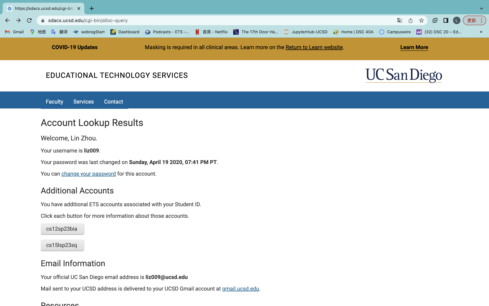
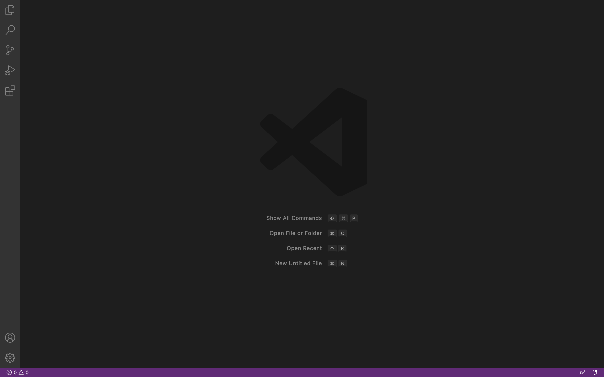
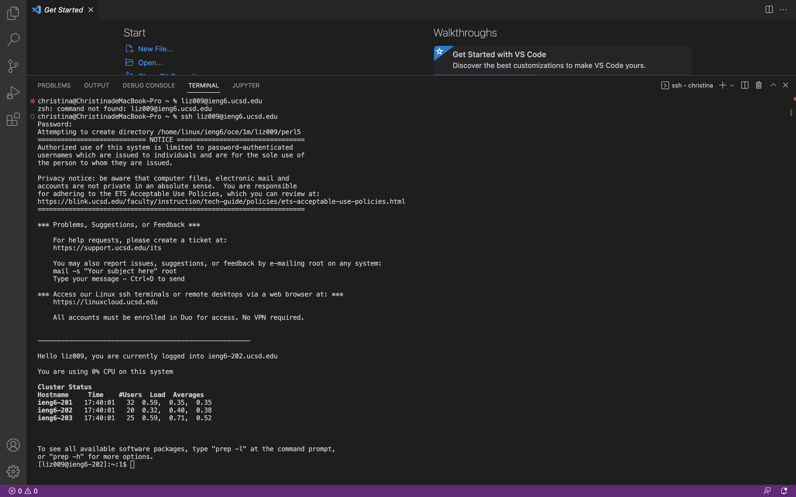
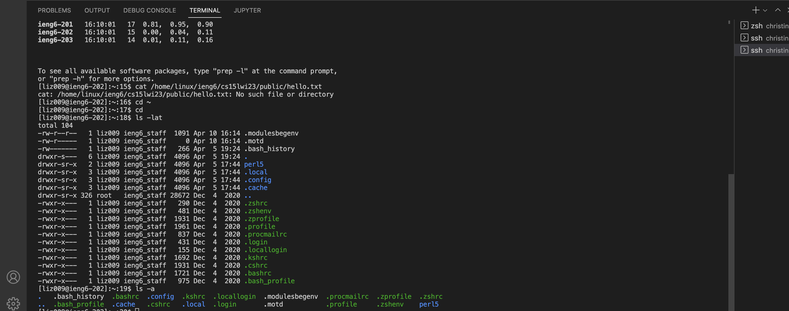

# Lab Report 1
## Lin Zhou
## A16416268
## CSE 15L
*Steps to guide everyone to connect their account*

* **Step 1:**
First we need to get into our CSE15L Account.(*Every students has their own CSE15L account*).

  1. We can look up our CSE15L Account through this [link](https://sdacs.ucsd.edu/~icc/index.php). 
  
  2. Fill in the Username with your specific UCSD ID(*The id on your UCSD gmail before @ucsd.edu*) and Student ID with your PID(**Axxxxxxxx**). Then click the blue Submit botton.
  
  3. Then you can log in to your account and you would see a page like this: 
   (*the one start with cs15l under the Additional Accounts is your account name*)
  
  4. Click the cs15l account name and you would be navigated to a page, which there would be a link: [Global Password Change Tool](https://sdacs.ucsd.edu/~icc/password.php)
  
  5. Click that link and you will be navigated to a page with a new link [Proceed to the Password Change Tool](https://password.ucsd.edu/)
  
  6. Click that link, and your will see a box asking you to enter your username. Enter your username(*Your UCSD username is usually the first part of your UCSD email address, e.g. for invoker@ucsd.edu, "invoker" is the username*)
  
  7. After submitting your username, click **I know my current AD password and would like to change it**, and login with your ucsd account. You would receive an email in your UCSD email with link about changing your password.
  
  8. Enter your current password and your new password, but do not click the blue botton `Change Password`, instead, after confirm your new password, just directly press enter on your keyboard.
```
# Congratulations! You have finished Logging into your CSE15L account!
```
* **Step 2:**
Second, We need to setup Visual Studio Code. Go to the [Visual Studio Code website](https://code.visualstudio.com/). Following the instructions on the website to download and install the newest and correct version(**macOS for Macs and Windows for PCs**) on your computer.

Once you finished, you should be able to open a window like this:

(*It might be in different colors, menu bar, depending on the system and settings*)

```
# Congratulations! You have succeeded to have VScode on your computer, it is a powerful tool and would be quite helpful for this course! Now we already have everything to have remotely connect, only one step to success.
```

* **Step 3:**
Last, we can get start to get on the remote server. But for windows users, you may still need to do a litter more things.(**Download Git and using bash in VScode**), I didn't do that since my system is macOS. And here are instructions for mac users.
 1. On the top of your screen, click `Terminal` --> `New Terminal`
 2. Then you will need to use ssh by typing ssh (your cse15L account)@ieng6.ucsd.edu. The command block should look roughly like this(replace sq with your course-specific account):
 ```
 christina@ChristinadeMacBook-Pro ~ % ssh cs15lsp23sq@ieng6.ucsd.edu
 ```
 3. Since this probabily your first time connect to this server, you will get a message like this:
 ```
 christina@ChristinadeMacBook-Pro ~ % ssh cs15lsp23sq@ieng6.ucsd.edu
 The authenticity of host 'ieng6.ucsd.edu (128.54.70.227)' can't be established.
RSA key fingerprint is SHA256:ksruYwhnYH+sySHnHAtLUHngrPEyZTDl/1x99wUQcec.
Are you sure you want to continue connecting (yes/no/[fingerprint])? 
 ```
 Just Type yes and press enter, and then enter your password(which you just reset)
 
 (*You might probabily fail to log in, this might cause by the delay of resetting the password on the server. You could wait for 15-30 mins after resetting the password or login with (your ucsd username)@ieng6.ucsd.edu and with your ucsd password.*)

 4. If you have everything done correctly, you would see something like below:
 
 
 ```
 # Congratulations! You have just succeeded to connect to the server! Let's try some command to see what we can do on the server!
 ```
 
 ## Running some commands on the server
 Some useful commands to try:
 * `cd ~`
 * `cd`
 * `ls -lat`
 * `ls -a`
 * `ls <directory>` , where `<directory>` is `/home/linux/ieng6/cs15lsp23/cs15lsp23sq`, where`sq` is one of the other group members' username for this course
 * `cp /home/linux/ieng6/cs15lsp23/public/hello.txt ~/`
 * `cat /home/linux/ieng6/cs15lwi23/public/hello.txt`
 
 > Here is the example that I tried `ls -lat` and `ls -a` on my computer: 
 
 
```
# Having fun exploring what you could do in the server! If you want to quit or log out of the remote server in your terminal, you can use
* Ctrl-D
* Run the command exit
```
