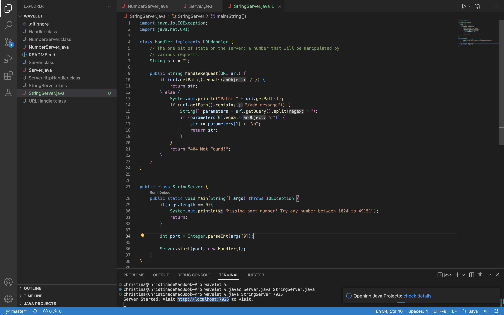
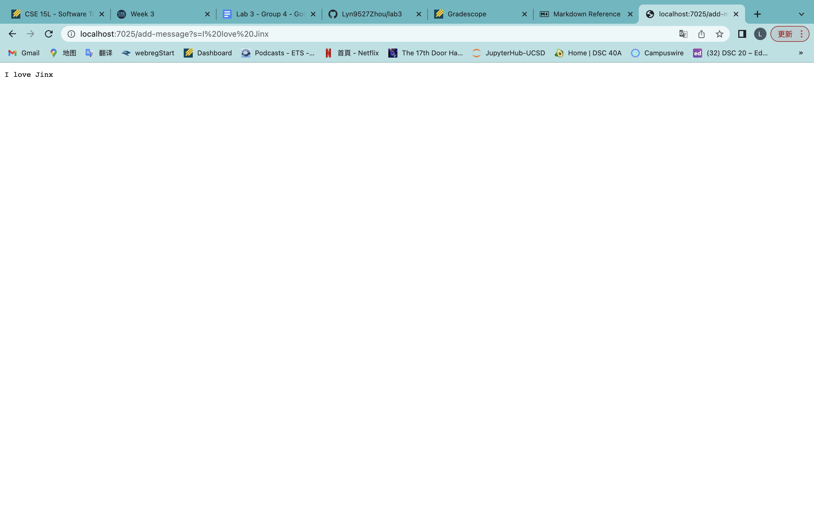
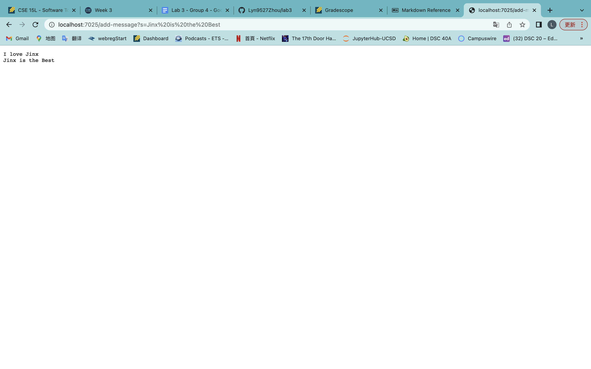
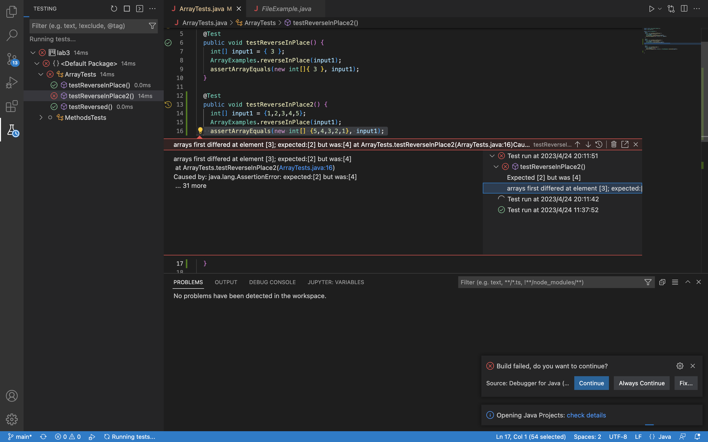
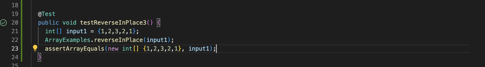

# Lab Report 2
## Lin Zhou
## A16416268
## CSE 15L
*Create a string server and debug*

# Create A String Server
>Here is my code for the string server:
>

>Here is one example that I run my server:
>

In this example, you can see my url is `http://localhost:7025/add-message?s=I%20love%20Jinx`. The `localhost:7025` is my domain, `/add-message` is my path, and
`?s=I%20love%20Jinx` is my query.
This url would call the methods `handleRequest(URI url)` in my `Handler` class. The relevant arguments in this method are

* `url.getPath()`, which is the path of this url(`/add-message`).
* `str`, which is initially setted as empty string, and changed to "I love Jinx \n"
* `url.getQuery()`, which is the query of this url(`s=I%20love%20Jinx`)
* `parameters`, which is a string array `["s", "I%20love%20Jinx"]` created by separating query by "="

The only value got changed by this request is str (**from empty string to** `I love Jinx`). Let's see how this value changes:
1. This method first check whether the path of the url is equal to `/`, if not it fall in the else statement.
2. Then in the else statement, it would check whether the path of the url contains `/add-message` 
3. If the path does contains `/add-message`, it would first separate the query of this url into array by "=" and save the created array as `parameters`
4. Then it would check whether the query before "=" equals "s". If it does, str would add(plus) the part of query after the "=" (*The string we wanted to add. In this case `I%20love%20Jinx`; `%20` means space in url*)
 and "\n" (*New line command*)
 
 
>Here is another example that I run my server:
>

In this example, you can see my url is `http://localhost:7025/add-message?s=Jinx%20is%20the%20Best`. The `localhost:7025` is my domain, `/add-message` is my path, and
`?s=Jinx%20is%20the%20Best` is my query.
This url would call the methods `handleRequest(URI url)` in my `Handler` class. The relevant arguments in this method are

* `url.getPath()`, which is the path of this url(`/add-message`).
* `str`, has value as "I love Jinx \n" changed to "I love Jinx\nJinx is the Best\n"
* `url.getQuery()`, which is the query of this url(`s=Jinx%20is%20the%20Best`)
* `parameters`, which is a string array `["s", "Jinx%20is%20the%20Best"]` created by separating query by "="

The only value got changed by this request is str (**from "I love Jinx \n" to "I love Jinx\nJinx is the Best\n"**). Let's see how this value changes:
1. This method first check whether the path of the url is equal to `/`, if not it fall in the else statement.
2. Then in the else statement, it would check whether the path of the url contains `/add-message` 
3. If the path does contains `/add-message`, it would first separate the query of this url into array by "=" and save the created array as `parameters`
4. Then it would check whether the query before "=" equals "s". If it does, str would add(plus) the part of query after the "=" (*The string we wanted to add. In this case `Jinx%20is%20the%20Best`; `%20` means space in url*)
 and "\n" (*New line command*)
 
 
 ---
 # Debug
 I would debug ArrayExamples for this part, here is the bugging code for the ArrayExamples:
 ```
 public class ArrayExamples {

  // Changes the input array to be in reversed order
  static void reverseInPlace(int[] arr) {
    for(int i = 0; i < arr.length; i += 1) {
      arr[i] = arr[arr.length - i - 1];
    }
  }
}
 ```
 
> Here is one failure-inducing input presenting as a junit test:
> ```
> @Test
>  public void testReverseInPlace2() {
>    int[] input1 = {1,2,3,4,5};
>    ArrayExamples.reverseInPlace(input1);
>    assertArrayEquals(new int[] {5,4,3,2,1}, input1);
>  }
> ```
> This input is expected to get {5,4,3,2,1} as an output, but it get {5,4,3,4,5} as the output
> Here is the image of the test failure as junit:
> 

> Here is one input that does not induce a failure presenting as a junit test:
> ```
> @Test
>  public void testReverseInPlace2() {
>    int[] input1 = {1,2,3,2,1};
>    ArrayExamples.reverseInPlace(input1);
>    assertArrayEquals(new int[] {1,2,3,2,1}, input1);
>  }
> ```
> This input is expected to get {1,2,3,2,1} as an output, and it got {1,2,3,2,1} as expected, so the test passed.
> Here is the image of the test as junit:
> 

This code apperantly create a symmetric array instead of creating an inversed array. I think it is cased by `arr[i] = arr[arr.length - i - 1]` as it would change the oringinal array from back with the beginning elements, but the elements from the latter index(after the middle index) are not saved, which would caused the new array becomes symmetric.
Here is one way to fix this code to become functional:
```
 public class ArrayExamples {

  // Changes the input array to be in reversed order
  static void reverseInPlace(int[] arr) {
    int[] temp = arr;
    for(int i = 0; i < arr.length; i += 1) {
      arr[i] = temp[temp.length - i - 1];
    }
  }
}
```
In the code block above, I saved the input array into a new int array called temp before the for loop. In this way, as the elements changed in the input array from the back, it won't have any impacts on the array we are copying elements from, which is temp. 
