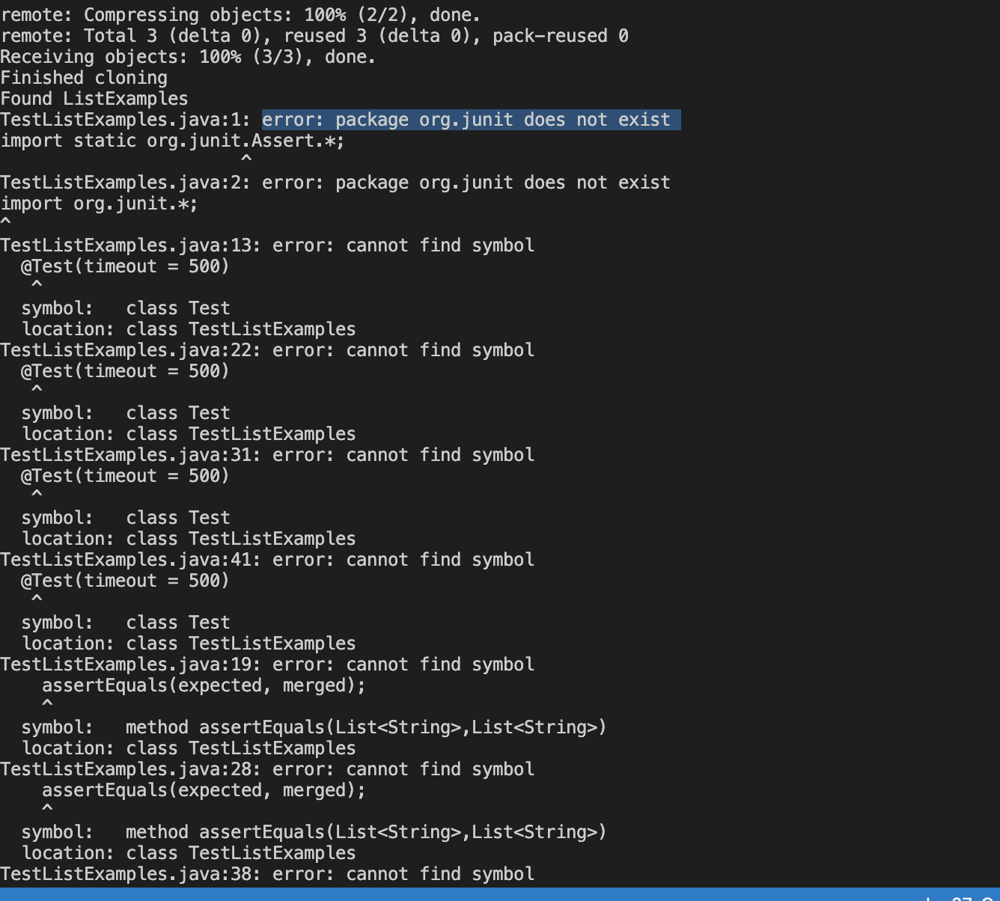
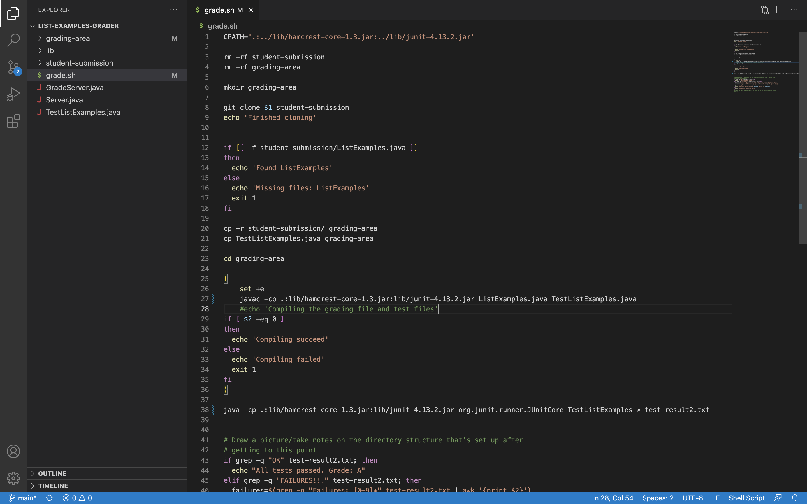
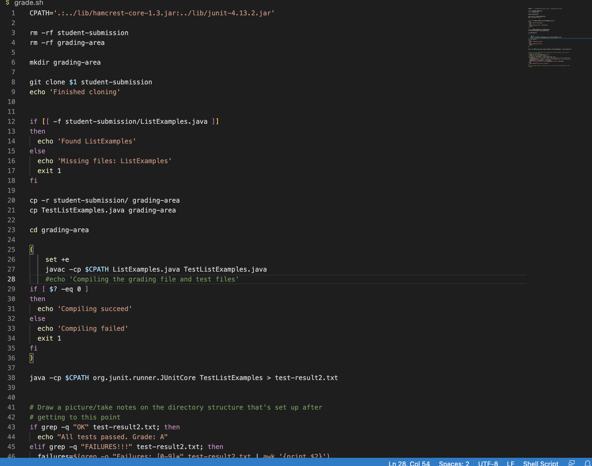
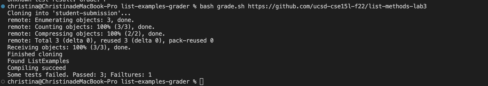
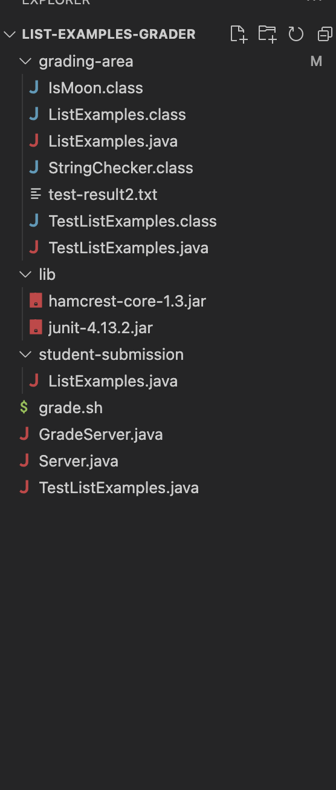

# Lab Report 5
## Lin Zhou
## A16416268
## CSE 15L
*Part I: Debugging Scenario Simulation*


## Original post
**What environment are you using (computer, operating system, web browser, terminal/editor, and so on)?**

A: I use macbook, and I test the code on VScode using terminal. 

**Detail the symptom you're seeing. Be specific; include both what you're seeing and what you expected to see instead. Screenshots are great, copy-pasted terminal output is also great. Avoid saying “it doesn't work”.**

A: I was trying to complie and run the test file which are "ListExamples.java" and "TestListExamples.java". I checked the current working directory and the path. Everything seems to be fine to me. But I kept getting the error message as "error: package org.junit does not exist" like this 

Here is my code: 

This is supposed to complie and run the test file and redirect the result to the test-result2.txt file.

**Detail the failure-inducing input and context. That might mean any or all of the command you're running, a test case, command-line arguments, working directory, even the last few commands you ran. Do your best to provide as much context as you can.**

A: I think this may be caused by the `javac -cp .:lib/hamcrest-core-1.3.jar:lib/junit-4.13.2.jar ListExamples.java TestListExamples.java`

and `java -cp .:lib/hamcrest-core-1.3.jar:lib/junit-4.13.2.jar org.junit.runner.JUnitCore TestListExamples > test-result2.txt`  

I run this `grade.sh` in the terminal using command `bash grade.sh https://github.com/ucsd-cse15l-f22/list-methods-corrected`


## TA Response
Hi, the error message `error: package org.junit does not exist` means that it did not find your `Junit` package thus it can not compile and run. You might need to check your path set and the variable `CPATH` on the top of the file. This variable is set equal to `'.:../lib/hamcrest-core-1.3.jar:../lib/junit-4.13.2.jar'` and this one directs to the directory where `junit-4.13.2.jar` and `hamcrest-core-1.3.jar` is located. I saw you are using `.:lib/hamcrest-core-1.3.jar:lib/junit-4.13.2.jar` in javac and `.:lib/hamcrest-core-1.3.jar:lib/junit-4.13.2.jar` in java. 
I would suggest you to change that to `$CPATH` and see what would happen, ie, change that two lines of code into `javac -cp $CPATH ListExamples.java TestListExamples.java` and `java -cp $CPATH org.junit.runner.JUnitCore TestListExamples > test-result2.txt`


## Student's response/feedback
Hi, Thanks! It works perfectly now!
Here is my changed code:

And here is my expected result:


I think now I understand why this bug came out. I directly used the code that was provided to complie and run the test Junit from week3's lab and that one has a little bit different with the one we are using right now and we are already provided the path for the `junit` and `hamcrest-core`. Thus we could directly use the variable defined above. Thanks for the help.

**Here is the file & directory structure needed**


**contents of each files before fix the bug**
Here is the content for `grade.sh`:
```
CPATH='.:../lib/hamcrest-core-1.3.jar:../lib/junit-4.13.2.jar'

rm -rf student-submission
rm -rf grading-area

mkdir grading-area

git clone $1 student-submission
echo 'Finished cloning'


if [[ -f student-submission/ListExamples.java ]]
then
  echo 'Found ListExamples'
else
  echo 'Missing files: ListExamples'
  exit 1
fi

cp -r student-submission/ grading-area
cp TestListExamples.java grading-area

cd grading-area

(
    set +e
    javac -cp .:lib/hamcrest-core-1.3.jar:lib/junit-4.13.2.jar ListExamples.java TestListExamples.java
    #echo 'Compiling the grading file and test files'
if [ $? -eq 0 ]
then
  echo 'Compiling succeed'
else
  echo 'Compiling failed'
  exit 1
fi
)

java -cp .:lib/hamcrest-core-1.3.jar:lib/junit-4.13.2.jar org.junit.runner.JUnitCore TestListExamples > test-result2.txt


# Draw a picture/take notes on the directory structure that's set up after
# getting to this point
if grep -q "OK" test-result2.txt; then
  echo "All tests passed. Grade: A"
elif grep -q "FAILURES!!!" test-result2.txt; then
  failures=$(grep -o "Failures: [0-9]*" test-result2.txt | awk '{print $2}')
  successes=$(grep -o "Tests run: [0-9]*" test-result2.txt | awk '{print $3}')
  passed=$(expr "$successes" - "$failures")
  echo "Some tests failed. Passed: $passed; Failtures: $failures"
else
  echo "Unknown test result. Grade: F"
fi
# Then, add here code to compile and run, and do any post-processing of the
# tests
```

Here is the content for `GradeServer.java`:
```
import java.io.BufferedReader;
import java.io.IOException;
import java.io.InputStream;
import java.io.InputStreamReader;
import java.net.URI;
import java.net.URISyntaxException;
import java.util.Arrays;
import java.util.stream.Stream;

class ExecHelpers {

  /**
    Takes an input stream, reads the full stream, and returns the result as a
    string.

    In Java 9 and later, new String(out.readAllBytes()) would be a better
    option, but using Java 8 for compatibility with ieng6.
  */
  static String streamToString(InputStream out) throws IOException {
    String result = "";
    while(true) {
      int c = out.read();
      if(c == -1) { break; }
      result += (char)c;
    }
    return result;
  }

  /**
    Takes a command, represented as an array of strings as it would by typed at
    the command line, runs it, and returns its combined stdout and stderr as a
    string.
  */
  static String exec(String[] cmd) throws IOException {
    Process p = new ProcessBuilder()
                    .command(Arrays.asList(cmd))
                    .redirectErrorStream(true)
                    .start();
    InputStream outputOfBash = p.getInputStream();
    return String.format("%s\n", streamToString(outputOfBash));
  }

}

class Handler implements URLHandler {
    public String handleRequest(URI url) throws IOException {
       if (url.getPath().equals("/grade")) {
           String[] parameters = url.getQuery().split("=");
           if (parameters[0].equals("repo")) {
               String[] cmd = {"bash", "grade.sh", parameters[1]};
               String result = ExecHelpers.exec(cmd);
               return result;
           }
           else {
               return "Couldn't find query parameter repo";
           }
       }
       else {
           return "Don't know how to handle that path!";
       }
    }
}

class GradeServer {
    public static void main(String[] args) throws IOException {
        if(args.length == 0){
            System.out.println("Missing port number! Try any number between 1024 to 49151");
            return;
        }

        int port = Integer.parseInt(args[0]);

        Server.start(port, new Handler());
    }
}

class ExecExamples {
  public static void main(String[] args) throws IOException {
    String[] cmd1 = {"ls", "lib"};
    System.out.println(ExecHelpers.exec(cmd1));

    String[] cmd2 = {"pwd"};
    System.out.println(ExecHelpers.exec(cmd2));

    String[] cmd3 = {"touch", "a-new-file.txt"};
    System.out.println(ExecHelpers.exec(cmd3));
  }
}
```

Here is the content for `Server.java`:
```
// A simple web server using Java's built-in HttpServer

// Examples from https://dzone.com/articles/simple-http-server-in-java were useful references

import java.io.IOException;
import java.io.OutputStream;
import java.net.InetSocketAddress;
import java.net.URI;

import com.sun.net.httpserver.HttpExchange;
import com.sun.net.httpserver.HttpHandler;
import com.sun.net.httpserver.HttpServer;

interface URLHandler {
    String handleRequest(URI url) throws IOException;
}

class ServerHttpHandler implements HttpHandler {
    URLHandler handler;
    ServerHttpHandler(URLHandler handler) {
      this.handler = handler;
    }
    public void handle(final HttpExchange exchange) throws IOException {
        // form return body after being handled by program
        try {
            String ret = handler.handleRequest(exchange.getRequestURI());
            // form the return string and write it on the browser
            exchange.sendResponseHeaders(200, ret.getBytes().length);
            OutputStream os = exchange.getResponseBody();
            os.write(ret.getBytes());
            os.close();
        } catch(Exception e) {
            String response = e.toString();
            exchange.sendResponseHeaders(500, response.getBytes().length);
            OutputStream os = exchange.getResponseBody();
            os.write(response.getBytes());
            os.close();
        }
    }
}

public class Server {
    public static void start(int port, URLHandler handler) throws IOException {
        HttpServer server = HttpServer.create(new InetSocketAddress(port), 0);

        //create request entrypoint
        server.createContext("/", new ServerHttpHandler(handler));

        //start the server
        server.start();
        System.out.println("Server Started! Visit http://localhost:" + port + " to visit.");
    }
}
```

Here is the content for `TestListExamples.java`:
```
import static org.junit.Assert.*;
import org.junit.*;
import java.util.Arrays;
import java.util.List;

class IsMoon implements StringChecker {
  public boolean checkString(String s) {
    return s.equalsIgnoreCase("moon");
  }
}

public class TestListExamples {
  @Test(timeout = 500)
  public void testMergeRightEnd() {
    List<String> left = Arrays.asList("a", "b", "c");
    List<String> right = Arrays.asList("a", "d");
    List<String> merged = ListExamples.merge(left, right);
    List<String> expected = Arrays.asList("a", "a", "b", "c", "d");
    assertEquals(expected, merged);
  }
  
  @Test(timeout = 500)
  public void testMergeRightEnd1() {
    List<String> left = Arrays.asList("a", "a", "b");
    List<String> right = Arrays.asList("a", "a");
    List<String> merged = ListExamples.merge(left, right);
    List<String> expected = Arrays.asList("a", "a", "a", "a", "b");
    assertEquals(expected, merged);
  }

  @Test(timeout = 500)
  public void testFilter1() {
    List<String> left = Arrays.asList("Moan", "Moon", "Mooooon");
    List<String> right = Arrays.asList("Mo0n", "mOoN");
    IsMoon sc = new IsMoon();
    List<String> filtered = ListExamples.filter(left, sc);
    List<String> expected = Arrays.asList("Moon");
    assertEquals(expected, filtered);
  }

  @Test(timeout = 500)
  public void testFilter2() {
    List<String> left = Arrays.asList("Moan", "Moon", "Mooooon");
    List<String> right = Arrays.asList("Mo0n", "mOoN");
    IsMoon sc = new IsMoon();
    List<String> filtered = ListExamples.filter(right, sc);
    List<String> expected = Arrays.asList("mOoN");
    assertEquals(expected, filtered);
  }
}
```

**Here is the full command line that I ran to trigger the bug:**
`bash grade.sh https://github.com/ucsd-cse15l-f22/list-methods-corrected`


**A description of what to edit to fix the bug**
We need to changed the code `javac -cp .:lib/hamcrest-core-1.3.jar:lib/junit-4.13.2.jar ListExamples.java TestListExamples.java` and `java -cp .:lib/hamcrest-core-1.3.jar:lib/junit-4.13.2.jar org.junit.runner.JUnitCore TestListExamples > test-result2.txt` in `grade.sh` to `javac -cp $CPATH ListExamples.java TestListExamples.java` and `java -cp $CPATH org.junit.runner.JUnitCore TestListExamples > test-result2.txt` respectively. In this way, it would be directory correctly to the location of our `Junit` package and compile and run the file successfully.


*Part II: Reflection*

From the second half part of the lab, I really learned some new things. The most exciting one must be create an autograder by my own. Before, I was always wondering how the autograder works, that is amazing. Now, I knew the deepdown logic and I could build one by my own now. Besides, I also learned more about debugging and github operations, which are all helpful.
