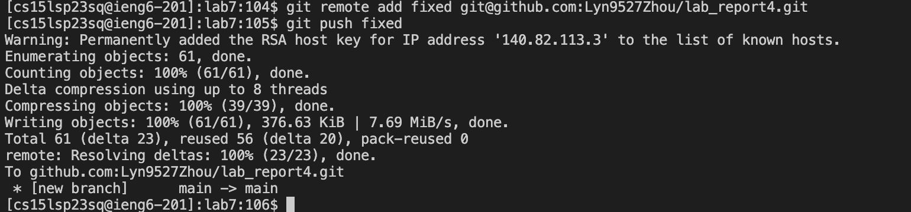

# Lab Report 4
## Lin Zhou
## A16416268
## CSE 15L
*Command Line Tasks*

**Step 4:**
Keys pressed: `ssh cs15lsp23sq@ieng6.ucsd.edu<enter>`, `Hpcc622501asdf@<enter>` 
*using this command line to log into my ieng6 account, press `enter` to operate the command.*

**Step 5:**
Keys pressed: `git clone https://github.com/ucsd-cse15l-s23/lab7<enter>`
*using this `git clone` command to clone documents and files from the github repository by the link `https://github.com/ucsd-cse15l-s23/lab7`, then press `enter` to operate the command*

**Step 6:**
Keys pressed:`cd lab7<enter>`, `bash test.sh<enter>`
*using `cd` to change our current working directory to `lab7`, and then `bash test.sh` to run the tests on the `ListExamples.java` in the `test.sh` file, then press `enter` to operate the command*

**Step 7:**
Keys pressed:`vim ListExamples.java<enter>`, `/index1<enter>`, `nnnnnnnnn`, `e`, `x`, `i`, `2`, `<esc>`, `:wq<enter>`
*using `vim` to open the `ListExamples.java` file, then use `/index1` to find the word `index1` in that file (like `<command> + F`), then press `n` 9 times to get to the `index1` we want, and then press `e` to go direct to the end of the word, then press `x` to delete the `1`, press `i`
to edit the file, press `2` to change that to `index2`, then press `<esc>` to exit the edit mode, press `:wq` to save and exit the file, then press `enter` to operate the command*

**Step 8:**
Keys pressed:`bash test.sh<enter>`, `exit<enter>`
*using `bash test.sh` to run the tests on the `ListExamples.java`(which we already fixed) in the `test.sh` file, then press `enter` to operate the command, `exit` to exit the remote server.*

**Step 9:**
Keys pressed:`ssh-keygen<enter><enter><enter>`, `ssh cs15lsp23sq@ieng6.ucsd.edu<enter>`, `Hpcc622501asdf@<enter>`, `mkdir .ssh<enter>`, `exit<enter>`, `scp /Users/christina/.ssh/id_rsa.pub cs15lsp23sq@ieng6.ucsd.edu:~/.ssh/authorized_keys<enter>`, `Hpcc622501asdf@<enter>`*using `ssh-keygen` to create a file hold SSH key, then keep pressing `<enter>` to see the path of the file, then use `ssh cs15lsp23sq@ieng6.ucsd.edu` and enter my password to enter my remote serve, then enter `mkdir.ssh` to copy the key, `exit` to exit the server, then use `scp /Users/christina/.ssh/id_rsa.pub cs15lsp23sq@ieng6.ucsd.edu:~/.ssh/authorized_keys` and enter the password again to copy that key into the ssh key file we just created, press `enter` to operate the commands*

**Step 10:**
Keys pressed:`ssh cs15lsp23sq@ieng6.ucsd.edu<enter>`, `ssh-keygen<enter><enter><enter>`, `cat /home/linux/ieng6/cs15lsp23/cs15lsp23sq/.ssh/id_rsa.pub<enter>`, open **github** on web, click on **profile photo**, and then click **setting**, click **SSH and GPG keys**, click **New SSH key**, click **Title**, and enter `Lin's ieng6 machine`, copy the output of `cat /home/linux/ieng6/cs15lsp23/cs15lsp23sq/.ssh/id_rsa.pub` before, and paste in the **Key** field by enter `<command+c>`, `<command+v>`, click **Add SSH key**, `ssh-keyscan -t rsa github.com >> ~/.ssh/known_hosts<enter>`, `ssh -T git@github.com`
*use `ssh cs15lsp23sq@ieng6.ucsd.edu<enter>` to enter the remote server, `ssh-keygen` to create a file hold SSH key, then keep pressing `<enter>` to see the path of the file, `ssh-keyscan -t rsa github.com >> ~/.ssh/known_hosts<enter>` to add `Github.com` as a recognized host, `ssh -T git@github.com` to test successfully connected, press `enter` to operate the commands*

**Step 11:**
Keys pressed:go to **github.com** and create a new repository, and copy the **SSH key** from the repository. Back to the remote server terminal, `git remote add fixed git@github.com:Lyn9527Zhou/lab_report4.git<enter>`, `git push fixed<enter>`
*use `git remote add fixed git@github.com:Lyn9527Zhou/lab_report4.git` to add it, and `git push fixed<enter>` to commit and push it to our github repository.*

**Congratulation!! We finished!**
