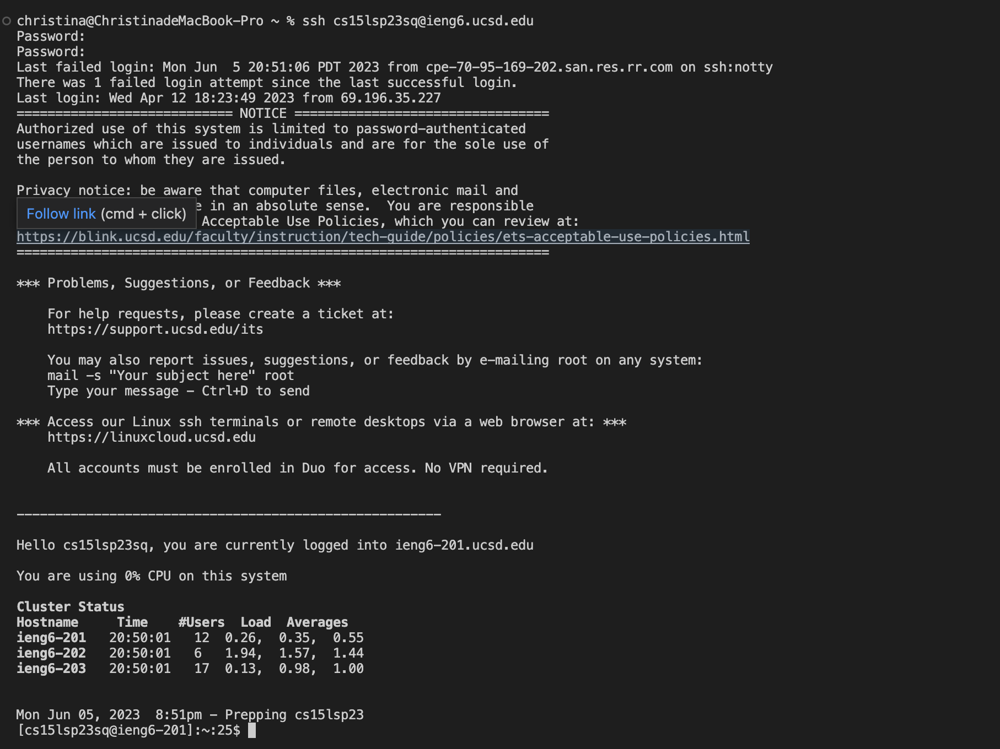
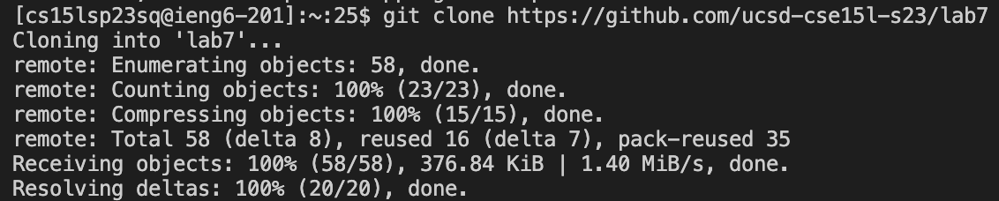
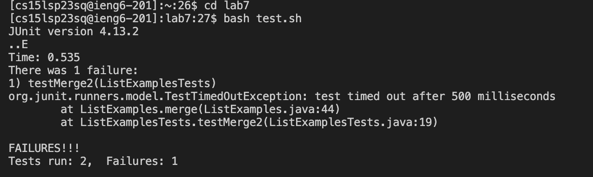
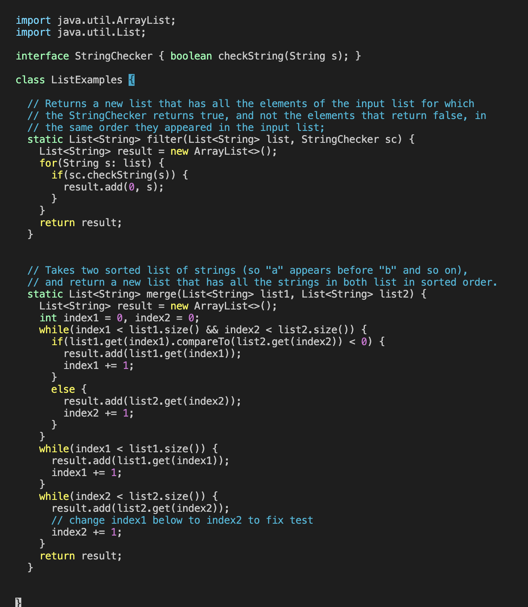
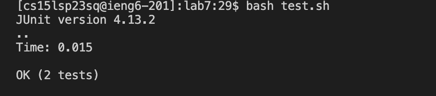
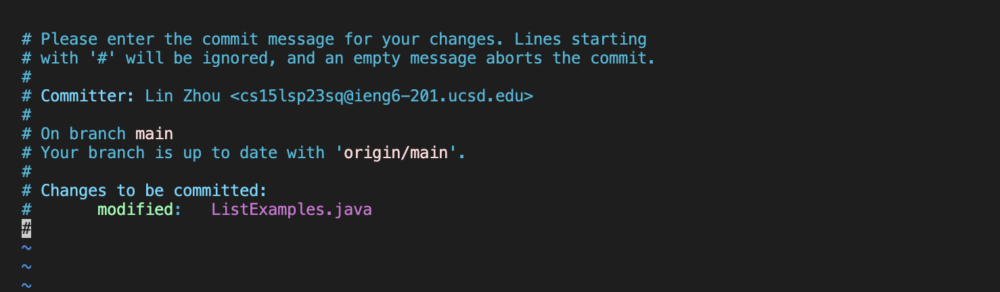

# Lab Report 4
## Lin Zhou
## A16416268
## CSE 15L
*Command Line Tasks*

**Step 4:**
Keys pressed: `ssh cs15lsp23sq@ieng6.ucsd.edu<enter>`, `Hpcc622501asdf@<enter>` 
*using this command line to log into my ieng6 account, press `enter` to operate the command.*

**Step 5:**
Keys pressed: `git clone https://github.com/ucsd-cse15l-s23/lab7<enter>`
*using this `git clone` command to clone documents and files from the github repository by the link `https://github.com/ucsd-cse15l-s23/lab7`, then press `enter` to operate the command*

**Step 6:**
Keys pressed:`cd lab7<enter>`, `bash test.sh<enter>`
*using `cd` to change our current working directory to `lab7`, and then `bash test.sh` to run the tests on the `ListExamples.java` in the `test.sh` file, then press `enter` to operate the command*

**Step 7:**
Keys pressed:`vim ListExamples.java<enter>`, `/index1<enter>`, `nnnnnnnnn`, `e`, `x`, `i`, `2`, `<esc>`, `:wq<enter>`
*using `vim` to open the `ListExamples.java` file, then use `/index1` to find the word `index1` in that file (like `<command> + F`), then press `n` 9 times to get to the `index1` we want, and then press `e` to go direct to the end of the word, then press `x` to delete the `1`, press `i`
to edit the file, press `2` to change that to `index2`, then press `<esc>` to exit the edit mode, press `:wq` to save and exit the file, then press `enter` to operate the command*

**Step 8:**
Keys pressed:`bash test.sh<enter>`
*using `bash test.sh` to run the tests on the `ListExamples.java`(which we already fixed) in the `test.sh` file, then press `enter` to operate the command*

**Step 9:**
Keys pressed:`git commit ListExamples.java<enter>`, `fixed the error<esc>`, `:eq<enter>`, `git push<enter>`, `Lyn9527Zhou<enter>`, `Hpcc622501<enter>`
*using `git commit` to commit the `ListExamples.java`, type `fixed the error` as commit message, `<esc> to exit the edit mode`, `:eq` to save and quit, `git push` to push the changed files, then the rest is entering the username and password, then press `enter` to operate the commands*

